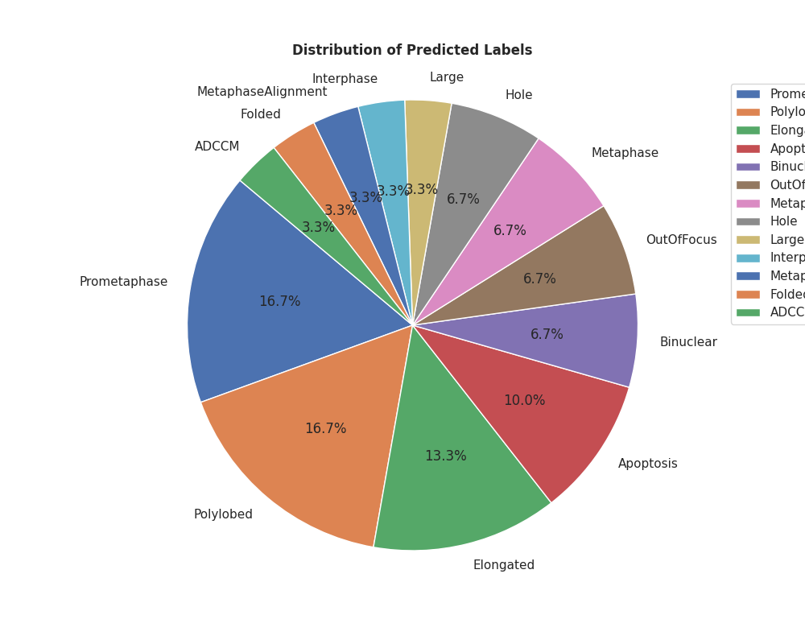

# CSCI-5931-FinalProject

Here are the directories in the project along with their purposes:

| Directory   | Description                                    |
|-------------|------------------------------------------------|
| configs     | Configuration files for the project settings.  |
| data        | Dataset storage and other data files.          |
| notebooks   | Jupyter notebooks illustrating the workflow used to train the model.|
| src         | Source code containing utility functions.      |

## About

We're developing a neural network model to identify different stages of cell division, aiming to enhance drug discovery.
This includes major stages like prophase, metaphase, anaphase, telophase, and cytokinesis, as well as intermediary states.
Understanding these stages can deepen our insight into cellular interactions with treatments, potentially leading to novel drug targets and more effective treatments.
Integrating cell division stages into drug screening enhances accuracy and reproducibility, fostering confidence in research findings.
Prioritizing compounds based on cell division stages optimizes resource allocation and accelerates drug development pipelines.
Ultimately, this contributes to improving public health outcomes by enabling the development of safer and more efficacious drugs, addressing unmet medical needs, and enhancing patient care and quality of life.

We utilized the MitoCheck dataset, available [here](https://zenodo.org/records/7967386), which contains labeled datasets spanning various stages of the cell cycle.
For details on data generation and labeling methodologies, please refer to the corresponding [paper](https://pubmed.ncbi.nlm.nih.gov/20360735/).

## Installation

To get started, follow these steps:

1. **Clone the repository:**

    ```bash
    git clone https://github.com/axiomcura/CSCI-5931-FinalProject.git
    cd CSCI-5931-FinalProject
    ```

2. **Create a Conda environment:**

    ```bash
    conda create --name cell_classifier python=3.11
    conda activate cell_classifier
    ```

3. **Install dependencies:**

    ```bash
    pip install -r requirements.txt
    ```

## Usage

### Design and Training the model

Below is the design of our neural network model:

1. Input Layer: Receives data, sized according to the desired number of categories.
2. Two Hidden Layers: The primary processing units. The first layer comprises 512 neurons, utilizing ReLU activation function for effective processing and including a dropout layer to prevent overfitting. The second hidden layer mirrors the first but with 256 neurons.
3. Output Layer: Provides the system's answer, with one neuron per category. Utilizes softmax to convert raw guesses into probabilities.
4. Training: Utilizes the Adam optimizer to adjust the learning rate. Model performance is evaluated using accuracy, indicating the frequency of correct answers.

The neural network mode was training spliting the data set 80/20 training and testing respectivly.
The model was trained for 25 epcosh with a batch size of 35

The neural network model was trained using an 80/20 split for training and testing data, respectively.
It underwent 25 epochs with a batch size of 35.

For insights into data processing, splitting, and model training, please consult the sub-modules located in the `./notebooks` directory.

### Using the Cell States Identifier Script

_**Assuming you have downloaded the package onto your computer**_

In this tutorial, we'll work with demo_data.csv, a small image-based profile containing quantified morphological features.

Let's dive into using the script:

To verify a successful installation, access the script's help documentation:

```bash
python cell_states_identifier.py -h
```

This will display available parameters:

```bash
Predict cellular states probabilities from an image-based profile.

Options:
  -h, --help            show this help message and exit
  -i INPUT, --input INPUT
                        Input image-based profile file
  -o OUTNAME, --outname OUTNAME
                        Output file name for saving the predicted probabilities
```

With the installation confirmed, let's use the script with demo data and set an output name:

```bash
python cell_states_identifier.py -i demo_data.csv -o exp_1_test
```

Upon execution, the script generates several files in a './results' folder:

- `exp_1_test_predicted_states.csv`: Contains the predicted cellular states
- `exp_1_test_population_proportions.csv`: Indicates the composition of cellular states within the dataset
- `exp_1_test_proportion_plot.png`: Provides a pie chart visualizing the proportion of cellular states within the population of cells.

To view the plot generate, type:

```bash
open results/exp_1_test_proportion_plot.png
```
This will display the plot generated:


Congratulations! Now you know the current cell stages your cells are in!

## Development technologies used

**Ruff**: Ruff is integrated into the repository to streamline code linting and formatting.
It ensures consistent code style across the project and helps maintain code quality.

**pre-commit**: Pre-commit hooks are set up to run various checks, such as code formatting with black and code linting with flake8, before each commit.
This helps catch potential issues early in the development process and ensures that all commits adhere to the project's coding standards.

**pip**: Pip is utilized as the package manager for installing Python dependencies required for development and running the project.
It simplifies the management of project dependencies and allows for easy installation of required packages.

**tensorflow**: TensorFlow is an important component of the repository, serving as the primary deep learning framework for building and training neural networks.
It provides tools and utilities for developing machine learning models, including neural network architectures, optimization algorithms, and evaluation metrics.
TensorFlow's versatility and extensive documentation make it well-suited for implementing complex deep learning algorithms and experiments.
